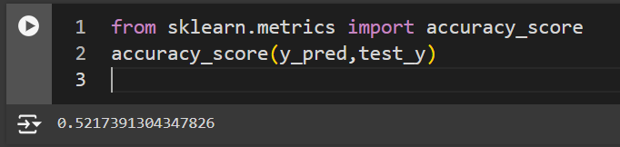

# Keysight_AI-ML-intern_EDA_domain
The repository contains the solution to Keysight problem statement given for AI/ML intern position in EDA Domain

Submitted by: Shreyas Gupta (MT23221)

## Problem Statement : 
Build a simple command-line interface (CLI) tool for managing tasks. The tool should allow users to add, view, complete, and delete tasks. Tasks should be stored in a text file (e.g., tasks.txt) so that they persist between sessions.

### Proposed Solution 1:
Developed a Python script which can allow user to perform different operations using command line interace(CLI). All the task operations are stored in text file which can be accessed even from a different session. The various possilbe operations inclued: add, view, complete, and delete tasks.

### CLI Outputs for Solution 1:

adding new task 1:

adding new task 2:

view task list:

mark task 2 as done:

view updated task list:

adding new task 3:

view updated task list:

delete task 1:

view updated task list:

exit task manager:

view task list from new session:

### Proposed Solution 2:
The *above solution is not user friendly*, as the user needs to select specific instructions which available in the menu to use the task manager. The user can only interact with the task manager by utilising pre defined input format.

So tried developing a *BERT based model* which can be used for *task intent classification based on input prompt given by user*. Then using the intent prediction output perform the required operation which matches the intent.This would give user the freedom of giving input prompt in natural language instead of selecting from the given menu.

classes for intent classification: [add_task, list_task, complete_task, delete_task].

example 1) input given by user can be 'Add "New book"', then the bert model should classify this intent as 'add_task' and then the add 'New book' to task list.

example 2) input given by user can be ' remove "cars"' then bert model should classify this as 'delete_task' and subsequently delete 'cars' from the task list.

In order to Fine tune BERT model, I *created a synthetic data set of 1600 entries* which will equally represent all class labels. This data was then split as 70-10-20 to perform cross validation.
The dataset looked like following:

Trained the model for 20 Epochs and got testing accuracy of about 52.2%

 

The model accuracy can be improved greatly by training for longer duration on a  proper dateset having significantly large number of entries revenant to the expected task which the task manager will perform. 

NOTE: This solution was only a proof of concept on how to build a BERT based model which can classify user intent based on given input prompt and then act as task manager to perform the intended tasks.
Given proper database access and domain knowledge for task manager this model can be optimised further.

### Outputs for Solution 2:

